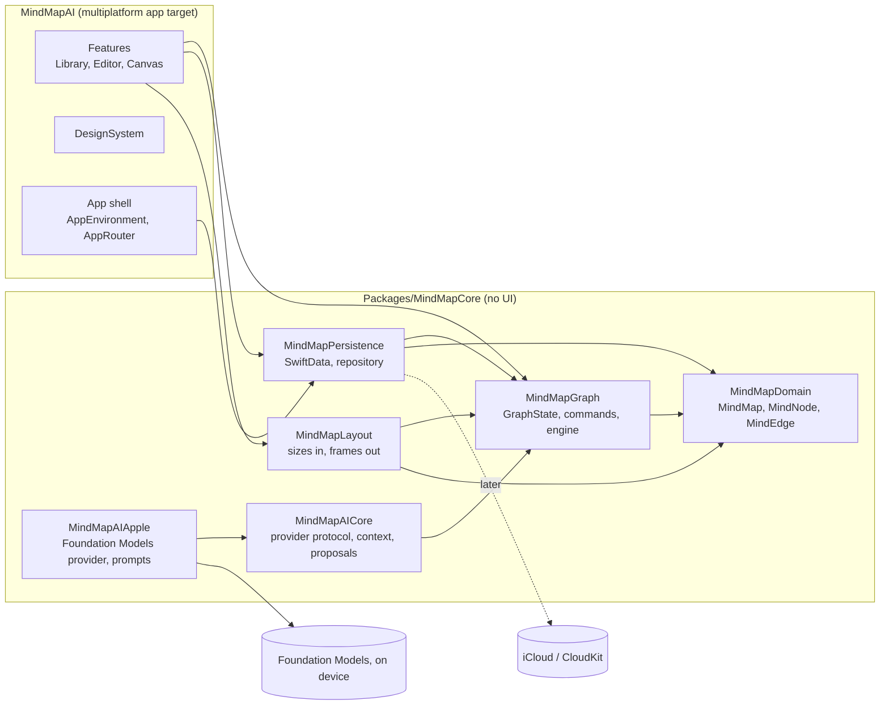

# Architecture

## Layers



| Module | Knows about | Never imports |
| --- | --- | --- |
| `MindMapDomain` | Foundation | SwiftUI, SwiftData, CloudKit, AI |
| `MindMapGraph` | Domain | SwiftUI, SwiftData, CloudKit, AI, screen coordinates |
| `MindMapPersistence` | Domain, Graph, SwiftData | SwiftUI |
| `MindMapLayout` | Domain, Graph, Foundation geometry types | SwiftUI, SwiftData ([[layout-engine]]) |
| `MindMapAICore` | Domain, Graph, NaturalLanguage | FoundationModels, SwiftUI, SwiftData |
| `MindMapAIApple` | AICore, FoundationModels (on-device model only) | Private Cloud Compute, SwiftUI, SwiftData |
| `MindMapInterchange` | Domain, Graph | SwiftUI, SwiftData, AI ([[interchange]]) |
| App target | All of the above, SwiftUI | SwiftData records directly |

The package boundary enforces these rules at compile time (ADR 0002). Later phases add packages the same way: layout, AI, import, export.

## Platforms

One SwiftUI target builds for macOS, iPadOS and iOS (ADR 0006). macOS runs natively with the App Sandbox. Platform differences stay inside views (`#if os(macOS)` for a modifier, a separate file when a whole view differs); models, sessions and the core package never branch on platform. On macOS the window's `UndoManager` drives the engine's history, so the Edit menu and ⌘Z work as on any Mac app.

## How an edit flows

```
View action ─▶ EditorSession builds a GraphCommand
            ─▶ GraphEngine.execute: transaction ▸ validate ▸ commit ▸ record history
            ─▶ GraphChangeSet (only the touched records)
            ─▶ MapRepository.save on its own actor, in order
            ─▶ SwiftData (▸ CloudKit once sync is on)
```

- **Commands are the only way to change a graph.** Keyboard, menu, drag, import and accepted AI proposals all become commands, so they all get the same validation, undo and saving path. AI never writes to SwiftData.
- **The engine is a value type.** `GraphEngine` holds a `GraphState` and its history. It has no clock, storage or UI of its own: tests drive it directly.
- **Undo replays recorded values.** Each command's `GraphChangeSet` keeps every touched value before and after; undo applies it reversed (ADR 0003).
- **Saving is incremental.** The repository writes only the records in the change set, plus the map's own record. Saves run on a `@ModelActor`, chained so they land in order, and never block the UI.

## State

| Kind | Lives in | Persisted |
| --- | --- | --- |
| Domain content (maps, nodes, edges) | `GraphState` ▸ repository | Yes |
| Undo history | `GraphEngine` | No |
| Selection, focus, open sheets | `EditorSession`, views | No |
| Navigation | `AppRouter` | No |
| AI suggestions (Phase 8) | Separate suggestion state | Only once accepted, as commands |
| Canvas camera, inline edit, canvas or outline | `CanvasModel`, `EditorSession.presentation` ([[canvas]]) | No; possibly per map later, as a preference |

## Concurrency

- Swift 6 language mode with strict concurrency checking. The app target defaults to `@MainActor` isolation.
- Domain and graph types are `Sendable` values. The repository is an actor.
- Work that may be slow (import, export, layout of large maps, AI) runs off the main actor in structured tasks and hands results back to `@MainActor` models. No detached tasks.

## Startup

`AppEnvironment.live()` opens the SwiftData store and nothing else. AI models, importers and exporters are created when first used. If the store cannot open, the app shows a recovery screen instead of crashing.

## Error handling

Errors that reach the user are categories with plain messages (could not save, could not open, iCloud unavailable, AI unavailable, unsupported file). Technical detail goes to `os.Logger` with private interpolation; map content is never logged.

## Testing

| Layer | How |
| --- | --- |
| Domain, Graph, Layout | Swift Testing in the package, `swift test` on the Mac host |
| Persistence | Swift Testing with in-memory and on-disk stores |
| AI | `MindMapAICoreTests` with `MockAIProvider`; `MindMapAIAppleTests` run the real model only where `SystemLanguageModel.default.isAvailable` |
| App | `MindMapAITests`, hosted on macOS: library and editor sessions end to end on an in-memory store |
| Platforms | `scripts/ci.sh` also builds for the iOS Simulator |
| UI | `MindMapAIUITests` (XCUITest) on macOS and the iOS Simulator with `scripts/ui-tests.sh`, in the `-uitest` mode with fixture maps; see [[testing]] |

There is no hosted CI. `scripts/ci.sh` is the gate before merging.
