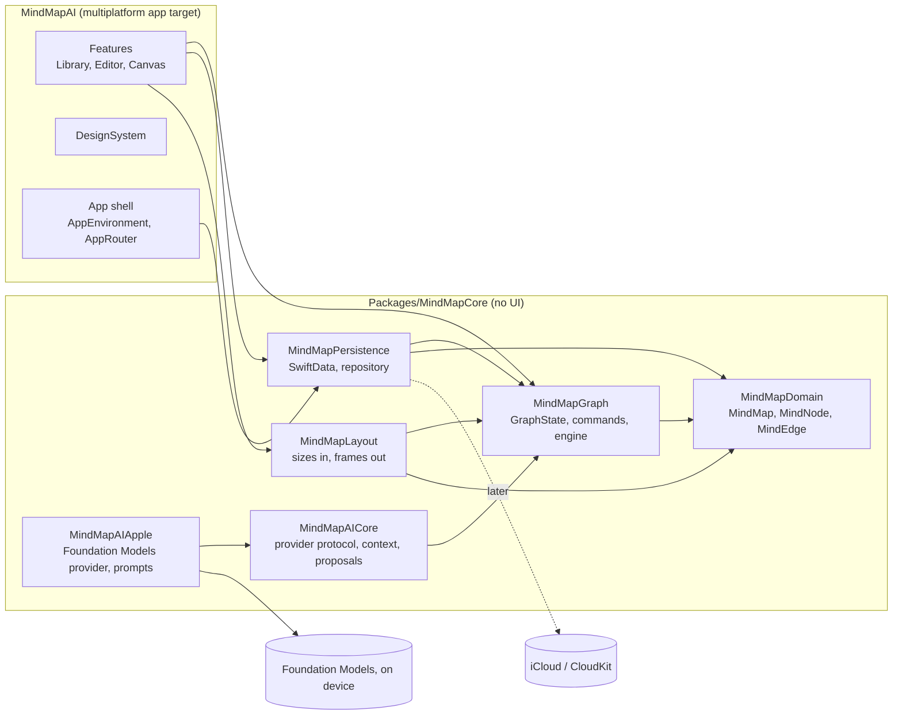

# Architecture

## Layers



| Module | Knows about | Never imports |
| --- | --- | --- |
| `MindMapDomain` | Foundation | SwiftUI, SwiftData, CloudKit, AI |
| `MindMapGraph` | Domain | SwiftUI, SwiftData, CloudKit, AI, screen coordinates |
| `MindMapPersistence` | Domain, Graph, SwiftData; Core Data only for its remote-change notification | SwiftUI |
| `MindMapLayout` | Domain, Graph, Foundation geometry types | SwiftUI, SwiftData ([[layout-engine]]) |
| `MindMapAICore` | Domain, Graph, NaturalLanguage | FoundationModels, SwiftUI, SwiftData |
| `MindMapAIApple` | AICore, FoundationModels (on-device model only) | Private Cloud Compute, SwiftUI, SwiftData |
| `MindMapInterchange` | Domain, Graph | SwiftUI, SwiftData, AI ([[interchange]]) |
| `MindMapSearch` | Domain, Graph: folding (case, Vietnamese marks, đ), library index and ranking, Find in a map | SwiftUI, SwiftData, AI |
| `MindMapSharing` | Domain, Graph, Persistence, Interchange | SwiftUI, AI ([[system-integration]]) |
| `MindMapIntents` | Sharing, Persistence, AppIntents, CoreSpotlight | SwiftUI, AI |
| `MindMapQuery` | Domain, Graph, Persistence (the `MapRepository` protocol), Search: read-only queries for MCP and the chat ([[mcp]]) | SwiftUI, AI, Network |
| Share Extension | Domain, Graph, Persistence, Interchange, Sharing, SwiftUI | AI, AppIntents |
| App target | All of the above, SwiftUI | SwiftData records directly |

The package boundary enforces these rules at compile time (ADR 0002). Later phases add packages the same way: layout, AI, import, export.

## Platforms

One SwiftUI target builds for macOS, iPadOS and iOS (ADR 0006). macOS runs natively with the App Sandbox. Platform differences stay inside views (`#if os(macOS)` for a modifier, a separate file when a whole view differs); models, sessions and the core package never branch on platform. On macOS the window's `UndoManager` drives the engine's history, so the Edit menu and ⌘Z work as on any Mac app.

The Mac app is universal (MM-21): the Release configuration builds `arm64 x86_64`, since macOS 26 is the last release for Intel Macs and the app targets 26. Debug builds only the active architecture. `scripts/ci.sh` fails if the Release app lacks either slice (`lipo -verify_arch`). On Intel the app is the same except AI: an x86_64 build never asks Foundation Models, `AppleCapabilityProbe` reports `deviceNotEligible`, so the AI menu, toolbar menu, topic menu items, canvas button, Settings section and the AI tools in the paywall are hidden ([[ai-architecture]]). Voice input stays: it uses Speech, not the language model.

`scripts/rosetta-tests.sh` runs the core and app tests as x86_64 under Rosetta (`-destination 'platform=macOS,arch=x86_64'`). It is optional and slow, since it builds everything again for x86_64. What it covers: the Intel slice compiles, links and passes the same tests, and AI reports `deviceNotEligible`. What it does not: the real Intel GPU and performance, and how Foundation Models and Speech behave on a real Intel Mac (under Rosetta the framework says the model is available, which is why the probe answers by architecture). Before a release that claims Intel support, open the TestFlight build on a real Intel Mac with macOS 26 once.

## How an edit flows

```
View action ─▶ EditorSession builds a GraphCommand
            ─▶ GraphEngine.execute: transaction ▸ validate ▸ commit ▸ record history
            ─▶ GraphChangeSet (only the touched records)
            ─▶ MapRepository.save on its own actor, in order
            ─▶ SwiftData (▸ CloudKit once sync is on)
            ─▶ MapRepository.changes(): .saved(summary) to every window's LibraryModel
```

- **Commands are the only way to change a graph.** Keyboard, menu, drag, import and accepted AI proposals all become commands, so they all get the same validation, undo and saving path. AI never writes to SwiftData.
- **The engine is a value type.** `GraphEngine` holds a `GraphState` and its history. It has no clock, storage or UI of its own: tests drive it directly.
- **Undo replays recorded values.** Each command's `GraphChangeSet` keeps every touched value before and after; undo applies it reversed (ADR 0003).
- **Saving is incremental.** The repository writes only the records in the change set, plus the map's own record. Saves run on a `@ModelActor`, chained so they land in order, and never block the UI.
- **The library listens, it does not poll.** Every window subscribes to the repository's change stream; writes from outside the repository arrive as `.storeChanged`, told apart from its own through persistent history ([[data-model]]).

## State

| Kind | Lives in | Persisted |
| --- | --- | --- |
| Domain content (maps, nodes, edges) | `GraphState` ▸ repository | Yes |
| Undo history | `GraphEngine` | No |
| Selection, focus, open sheets | `EditorSession`, views | Selection and canvas or outline per window, as scene state (`EditorRestoration`) |
| Navigation | `AppRouter` | Library section and open map per window, as scene state |
| AI suggestions (Phase 8) | Separate suggestion state | Only once accepted, as commands |
| Canvas camera, inline edit, canvas or outline | `CanvasModel`, `EditorSession.presentation` ([[canvas]]) | No; possibly per map later, as a preference |

## Windows

A map is open at most once in the app, whatever the number of windows (FR-PER-08). `OpenMaps` (in `AppEnvironment`) hands every window the same `OpenMap` (session, canvas model, AI assistant) for a map ID, so there is one engine and one save queue per map. Two sessions on one map would each save from a graph the other has not seen, and the later save would undo the earlier one in the store (`OpenMapsTests` shows it). When no window shows a map any more, `OpenMaps` keeps it until its last save is done, so reopening it at once gets the same session rather than a load that misses those saves.

The interface keeps one window per map too: picking a map that another window shows brings that window forward (`WindowHandle`: `NSWindow` on the Mac, `UISceneSession` activation on iPad) and leaves the current window as it was. File ▸ Open in New Window (⌥⌘O, and the library's context menu) shows a map in a `WindowGroup(for: MapID.self)` window of its own; on iPad that is one window per map in Stage Manager. The window that showed the map lets go of it first.

The engine's history is per map, but each window has its own `UndoManager`. A window that stops showing a map removes that map's actions from its undo manager, so ⌘Z there never reaches a map it no longer shows; the toolbar's Undo and Redo still step through the engine's history.

Each window keeps its library section, open map and editor state (selected topic IDs, canvas or outline) in `@SceneStorage`, so relaunching brings windows back as they were (FR-PER-09). Only IDs are stored, never map content. Topics deleted since are left out.

## Concurrency

- Swift 6 language mode with strict concurrency checking. The app target defaults to `@MainActor` isolation.
- Domain and graph types are `Sendable` values. The repository is an actor.
- Work that may be slow (import, export, layout of large maps, AI) runs off the main actor in structured tasks and hands results back to `@MainActor` models. No detached tasks.

## Startup

`AppEnvironment.live()` opens the SwiftData store and nothing else. AI models, importers and exporters are created when first used. If the store cannot open, the app shows a recovery screen instead of crashing.

## Error handling

Errors that reach the user are categories with plain messages (could not save, could not open, iCloud unavailable, AI unavailable, unsupported file). Technical detail goes to `os.Logger` with private interpolation; map content is never logged.

## Testing

| Layer | How |
| --- | --- |
| Domain, Graph, Layout | Swift Testing in the package, `swift test` on the Mac host |
| Persistence | Swift Testing with in-memory and on-disk stores; a migration harness on a checked-in V1 store; opt-in load and save benchmarks ([[data-model]]) |
| AI | `MindMapAICoreTests` with `MockAIProvider`; `MindMapAIAppleTests` run the real model only where the probe reports it ready (never in an x86_64 build) |
| App | `MindMapAITests`, hosted on macOS: library and editor sessions end to end on an in-memory store |
| Platforms | `scripts/ci.sh` also builds a universal macOS Release app (checks both slices) and builds for the iOS Simulator; `scripts/rosetta-tests.sh` runs the tests as x86_64 |
| UI | `MindMapAIUITests` (XCUITest) on macOS and the iOS Simulator with `scripts/ui-tests.sh`, in the `-uitest` mode with fixture maps; see [[testing]] |

There is no hosted CI. `scripts/ci.sh` is the gate before merging.
